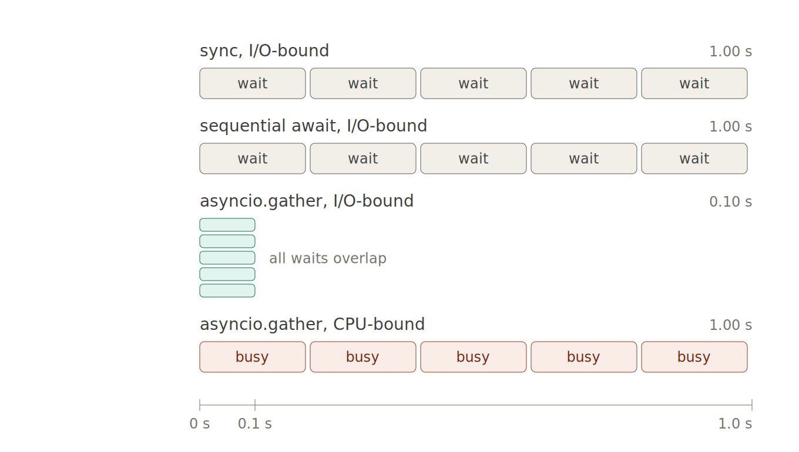

# asyncio benchmark: sync vs sequential await vs gather

A small, dependency-free benchmark that measures three ways of running the same
ten calls, across two different kinds of work.

The point it demonstrates: **`asyncio.gather` only speeds things up when the
coroutines actually `await` something.** Marking a function `async` and awaiting
it in a loop buys you nothing, and `gather` on CPU-bound work buys you nothing
either. Concurrency is not parallelism.

## The three strategies

| Strategy | What it does |
|---|---|
| `sync` | Plain blocking function, called one at a time |
| `sequential await` | `async` function, `await`ed one at a time in a loop |
| `asyncio.gather` | All coroutines handed to the event loop at once |

## The two workloads

| Workload | Simulated with | Yields to the event loop? |
|---|---|---|
| I/O-bound | `time.sleep` / `asyncio.sleep` | Yes — `asyncio.sleep` suspends the coroutine |
| CPU-bound | A tight arithmetic loop | No — there is no `await` inside |

## What the timings look like



Each block is one task; horizontal length is wall-clock time.

Rows one and two are drawn identically on purpose — that is the finding. The
third row collapses because each `asyncio.sleep` hands control back to the event
loop, which immediately starts the next coroutine, so all ten waits happen inside
the same 0.1s window. They are stacked vertically rather than laid end to end
because they occupy the *same* time, not consecutive time.

The fourth row is the trap. Structurally it is `gather` again, but the coroutine
never yields, so each one holds the single thread until it finishes — which lays
them out end to end exactly like row one.

## Running it

```bash
python3 asyncio_benchmark.py
```

No dependencies beyond the standard library. Python 3.7+ (`asyncio.run`).

## Sample output

```
10 tasks, 0.1s simulated latency each

I/O-BOUND
  sync (blocking, one by one)         1.002s
  async sequential await              1.005s
  asyncio.gather                      0.101s
  -> gather is 9.9x faster than sync
  -> theoretical floor: 0.100s (one task's latency)

CPU-BOUND
  sync (blocking, one by one)         1.050s
  async sequential await              1.005s
  asyncio.gather                      1.030s
  -> gather is 1.02x vs sync (expect ~1.0 or worse)
```

Absolute numbers vary by machine; the ratios are the interesting part.

## Configuration

Three constants at the top of the script, each annotated inline:

- `N_TASKS` — both workloads. Raising it widens the gather gap on I/O; changes
  nothing on CPU. At 100 tasks the I/O speedup approaches 100x, where the real
  ceiling becomes your connection limit rather than the event loop.
- `IO_DELAY` — I/O workload only. Per-task fake latency, and the floor `gather`
  converges to no matter how large `N_TASKS` gets.
- `CPU_ITERS` — CPU workload only. Tuned so the CPU total lands near the I/O
  total, otherwise the two sections stop being comparable at a glance. If you
  change `N_TASKS` or `IO_DELAY`, retune this.

## Notes on gather

- Results come back in the order the coroutines were passed in, regardless of
  which finished first.
- If one coroutine raises, `gather` propagates that exception immediately while
  the others keep running unawaited. Pass `return_exceptions=True` to collect
  failures alongside successes instead.
- For genuinely CPU-bound work, reach for `ProcessPoolExecutor` — separate
  processes, separate GILs. `asyncio.to_thread` helps only when the work releases
  the GIL (numpy, compiled extensions, blocking I/O in a C library).

## Files

| File | |
|---|---|
| `asyncio_benchmark.py` | The benchmark |
| `asyncio_benchmark_diagram.svg` | Diagram source, adapts to light/dark |
| `asyncio_benchmark_diagram.png` | Rendered at 2x for the README |
